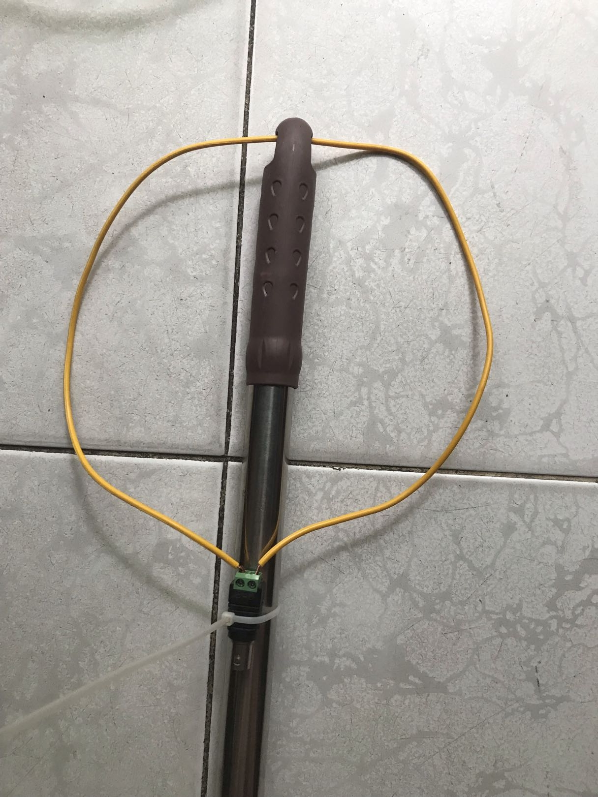

# Preface
As of February 2026, free-to-air (FTA) DVB-T2 TV saw increasingly less and less use in Vietnam, with most TV users trending more and more toward using Internet TV which offered convenience and mobility as they can watch most free channels on phones or laptops in comparison to the annoyance of having to put up and antenna. Moreover, a lot of people used on-demand video services and cable providers for subscription-based TV channels means even less people used paid DVB-T2 services. However, there are still a lot of channels being broadcasted over the air (OTA) but the up-to-date information about their channels and physical layer pipes (PLP) are not readily available on the Internet with a lot of outdated information mixed in. This is my attempt at reporting what TV channels are available in Ho Chi Minh City and what are their characteristics.

# Methodology
My setup included a standard DVB-T2 set-top box (STB) called TOPT2 (based on MStar MSD7T01 SoC and Rafael Micro R836 tuner) from a local company called Vũ Hồng Minh (VHM), a small 4.3 inch TFT LCD (sold on a lot of sites as monitor for car backup camera) and a homemade loop for the antenna. The STB conveniently reports the properties of the modulation of each channel and what is the PID used by the PLPs.

# Result
A scan revealed that there are 7 UHF channels currently in use in Ho Chi Minh City. Their modulation parameters are as follow:

| Channel      | Modulation Schemes | Guard Interval | FEC | FFT |
|:------------:|:------------------:|:--------------:|:---:|:---:|
| 25 (506 MHz) | 256-QAM            | 1/8            | 3/5 | 32k |
| 27 (522 MHz) | 256-QAM            | 1/8            | 3/5 | 32k |
| 33 (570 MHz) | 64-QAM             | 1/8            | 3/4 | 32k |
| 34 (578 MHz) | 256-QAM            | 1/8            | 2/3 | 32k |
| 42 (642 MHz) | 256-QAM            | 1/8            | 3/5 | 32k |
| 44 (658 MHz) | 256-QAM            | 1/8            | 3/5 | 32k |
| 45 (666 MHz) | 256-QAM            | 1/8            | 3/5 | 32k |

There used to be 2 more UHF channels (channel 30 and channel 55) used by VTC based on old information found on the Internet. However, after VTC ceased transmission in early 2025 those 2 channels are no longer in use. In addition, Ho Chi Minh City does not use VHF for TV transmission.

## Channel 25 (506 MHz) PLPs

| Name          | Subscription | PID            | LCN  |
|:-------------:|:------------:|:--------------:|:----:|
| VTV4 SD       | No           | 1041/1042/1041 | 0014 |
| VTV5 HD       | No           | 1051/1052/1051 | 0005 |
| VTV7 SD       | No           | 1071/1072/1071 | 0017 |
| VTV8 HD       | No           | 1081/1082/1081 | 0008 |
| VTV1 HD       | No           | 1111/1112/1111 | 0001 |
| VTV2 HD       | No           | 1121/1122/1121 | 0002 |
| VTV3 HD       | No           | 1131/1132/1131 | 0003 |
| VTV Can Tho   | No           | 1161/1162/1161 | 0006 |
| VTV9 HD       | No           | 1191/1192/1191 | 0009 |
| Vietnam Today | No           | 1201/1202/1201 | 0020 |

## Channel 27 (522 MHz) PLPs

| Name         | Subscription | PID            | LCN  |
|:------------:|:------------:|:--------------:|:----:|
| VTV4 HD      | No           | 1141/1142/1141 | 1001 |
| VTV7 HD      | No           | 1171/1172/1171 | 1002 |
| VTV5 TNB HD  | No           | 1511/1512/1511 | 1003 |
| CAN THO 3 HD | No           | 1251/1351/1251 | 1004 |

## Channel 33 (570 MHz) PLPs

| Name            | Subscription | PID            | LCN  |
|:---------------:|:------------:|:--------------:|:----:|
| HTV9            | No           | 3701/3801/3701 | 1005 |
| HTV7 HD         | No           | 3702/3802/3702 | 1006 |
| BTV6-SHOPPING 2 | No           | 3703/3803/3703 | 1007 |
| HTV1 HD         | No           | 3704/3804/3704 | 1008 |
| TH CAN THO 1 HD | No           | 3705/3805/3705 | 1009 |
| QPVN HD         | No           | 3706/3806/3706 | 1010 |
| SCTV10          | No           | 3707/3807/3707 | 1011 |
| TH DONG THAP 2  | No           | 2108/1108/2108 | 1012 |
| TH DONG THAP 1  | No           | 3709/3809/3709 | 1013 |
| HTV THE THAO    | No           | 3712/3812/3712 | 1014 |
| BPTTH DA NANG 2 | No           | 3713/3813/3713 | 1015 |
| TH BINH THUAN   | No           | 3714/3814/3714 | 1016 |
| BPTTH TAY NINH  | No           | 3715/3815/3715 | 1017 |
| BPTTH CAN THO 3 | No           | 3716/3816/3716 | 1018 |
| BPTTH DONG NAI  | No           | 3717/3817/3717 | 1019 |

## Channel 34 (578 MHz) PLPs

| Name            | Subscription | PID            | LCN  |
|:---------------:|:------------:|:--------------:|:----:|
| TH An Giang 2   | No           | 100/101/100    | 1020 |
| TH CAN THO 2    | No           | 4205/4305/4025 | 1021 |
| THVL1-HD        | No           | 4215/4315/4215 | 1022 |
| THVL2-HD        | No           | 4216/4316/4216 | 1023 |
| THVL3-HD        | No           | 4218/4318/4218 | 1024 |
| THVL4-HD        | No           | 4219/4319/4219 | 1025 |
| THVL5-HD        | No           | 4202/4302/4202 | 1026 |
| TH An Giang 1   | No           | 4206/4306/4206 | 1027 |
| TH Ca Mau       | No           | 4201/4301/4201 | 1028 |

## Channel 42 (642 MHz) PLPs

| Name               | Subscription | PID                | LCN  |
|:------------------:|:------------:|:------------------:|:----:|
| An Ninh TV         | Yes          | 5761/5762/5761     | 0004 |
| VTV5 Tay Nguyen    | Yes          | 5771/5772 AAC/5771 | 0015 |
| VTV5 Tay Nam Bo    | Yes          | 4171/4172 AAC/4171 | 0016 |
| VTV8               | Yes          | 1711/1712 AAC/1711 | 0019 |
| HY - Hung Yen HD   | No           | 4891/4892/4891     | 0078 |
| H1 - Ha Noi 1      | Yes          | 1371/1372 AAC/1371 | 0047 |
| VTV1 HD            | Yes          | 1181/1182 AAC/1181 | 0001 |
| VTV3               | Yes          | 1341/1342 AAC/1341 | 0003 |
| VTV2               | Yes          | 2421/2422 AAC/2421 | 0002 |
| KTV - Khanh Hoa HD | No           | 4811/4812/4811     | 0049 |
| THVL1 - Vinh Long  | No           | 1000/2000/1000     | 0039 |
| Vietnam Today      | Yes          | 1001/1002/1001     | 0010 |

## Channel 44 (658 MHz) PLPs

| Name                 | Subscription | PID                | LCN  |
|:--------------------:|:------------:|:------------------:|:----:|
| VTV Can Tho          | Yes          | 4121/4122 AAC/4121 | 0017 |
| VTV5                 | Yes          | 4471/4472 AAC/4471 | 0014 |
| VTV4                 | Yes          | 1225/1226 AAC/1225 | 0013 |
| VTV7 HD              | Yes          | 1045/1046 AAC/1045 | 0018 |
| Huong dan khach hang | No           | 4031/4032/4031     | 0011 |
| DW                   | Yes          | 1085/1086 AAC/1085 | 0021 |
| France 24            | Yes          | 2981/2982 AAC/2981 | 0022 |
| Channel News Asia    | Yes          | 4001/4002 AAC/4001 | 0023 |
| Arirang              | Yes          | 1241/1242 AAC/1241 | 0024 |
| TV5 Monde            | Yes          | 1065/1066 AAC/1065 | 0025 |
| NHK World            | Yes          | 1135/1136 AAC/1135 | 0026 |
| BTV9 - An Vien HD    | Yes          | 1000/2000 AAC/1000 | 0044 |
| HTV9                 | Yes          | 1001/1002 AAC/1001 | 0046 |

## Channel 45 (666 MHz) PLPs

| Name               | Subscription | PID                | LCN  |
|:------------------:|:------------:|:------------------:|:----:|
| NBTV - Ninh Binh   | No           | 2021/2022/2021     | 0072 |
| QPVN HD            | No           | 2581/2582/2581     | 0005 |
| BHTTV - Ha Tinh HD | No           | 4701/4702/4701     | 0079 |
| TN1 - Thai Nguyen  | No           | 4021/4022/4021     | 0012 |
| TTV - Tuyen Quang  | No           | 4991/4992/4991     | 0071 |
| NTV - Nghe An HD   | No           | 2561/2562/2561     | 0050 |
| THVL3 HD           | No           | 2038/2039/2038     | 0070 |
| THP - Hai Phong HD | No           | 4011/4012/4011     | 0075 |
| THP3 - Hai Phong   | No           | 1035/1036/1035     | 0076 |
| VTV9               | Yes          | 1000/2000 AAC/1000 | 0020 |
